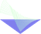

# <a href="https://github.com/jahearnco/Geriatric-Fall-Device">Geriatric Fall Device</a>

<a href="https://github.com/jahearnco/Geriatric-Fall-Device/blob/master/FallMonitor.cpp">FallMonitor.cpp</a>

<a href="https://github.com/jahearnco/Geriatric-Fall-Device/blob/master/FallMonitor.cpp">FallMonitor.h</a>
